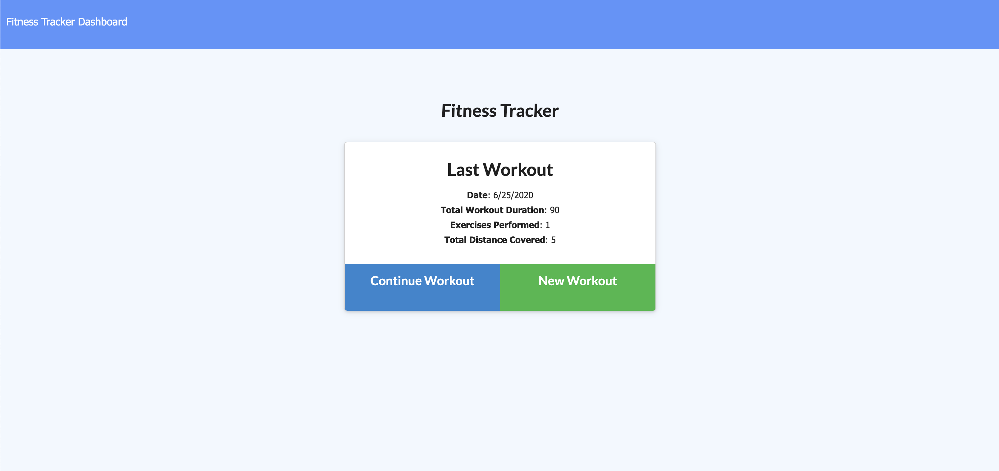

# workout_tracker

 
 
 
 

## Contents:
* [Authors](#authors)
* [Contributing](#contributing)
* [Acknowledgments](#acknowledgments)
* [Description](#description)
* [Installation](#installation)
* [Usage](#usage)
* [Tests](#tests)
* [Questions](#questions) 

## Authors:
Mike Zlotkowski

## Contributing:
NA

## Acknowledgments:
undefined

## Description:
Workout Fitness Tracker

## Installation:
run program with "node server.js" 

## Usage:
Workout and enter your stats

## Tests:

## Questions:
* GitHub Profile: MikeyZ89
* Contact Me @: michael.zlotkowski@gmail.com
* Comments: Fitness Tracker, really cool application, very useful.